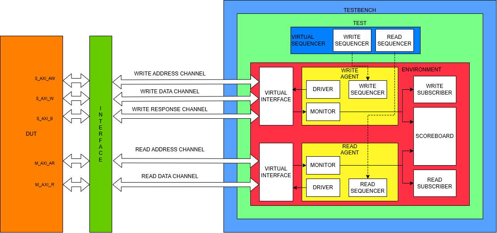
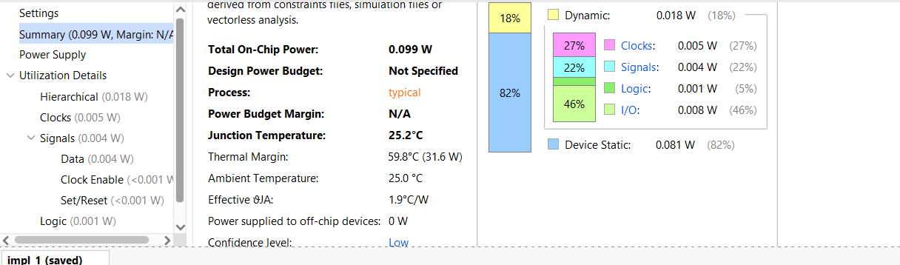
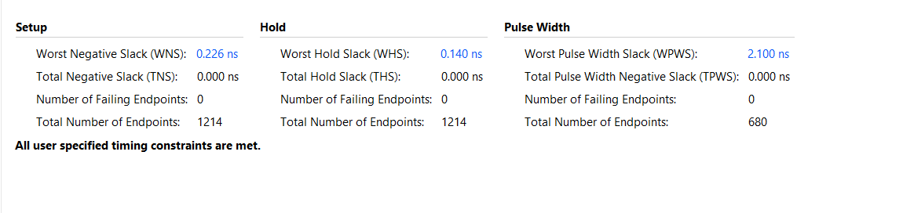
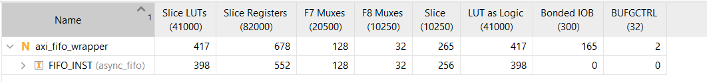

# AXI-based Asynchronous FIFO
This repository is a direct extension of the previously implemented [Asynchronous FIFO repository](https://github.com/veerx2704/async_fifo) 






This project implements an AXI wrapper over the asynchronous FIFO, aiming to achieve compatibility in a universal system. 

The file structure is as follows:
```axi_fifo
├── README.md
├── design
│   ├── adder.sv
│   ├── async_fifo.sv
│   ├── axi_fifo_wrapper.sv
│   ├── fifo_memory.sv
│   ├── operation_control.sv
│   └── single_flop.sv
├── testbench
│   ├── environment.sv
│   ├── include_files.sv
│   ├── read_agent.sv
│   ├── read_driver.sv
│   ├── read_interface.sv
│   ├── read_monitor.sv
│   ├── read_sequencer.sv
│   ├── read_subscriber.sv
│   ├── read_transaction.sv
│   ├── scoreboard.sv
│   ├── sequence.sv
│   ├── test.sv
│   ├── testbench.sv
│   ├── virtual_sequencer.sv
│   ├── write_agent.sv
│   ├── write_driver.sv
│   ├── write_interface.sv
│   ├── write_monitor.sv
│   ├── write_sequencer.sv
│   ├── write_subscriber.sv
│   └── write_transaction.sv
└── input_constraints.xdc
```

## Specifications
This project implements the standard AXI-4 bus protocol. It supports the main operations and signals of all 5 channels, with extensive verification through a UVM based testbench. The testbench uses constrained random stimulus with SystemVerilog Assertions.


## DESIGN

The design was synthesized using AMD Vivado 2024.2, and is on par with the baseline model with a frequency of 200MHz. The total power consumption for Kintex FPGA comes out to be 99mW. The design is lint-free and is CDC-safe has the following features:
 - Support for all 5 channels of AXI-4 base operations
 - Power consumption of 99mW at 200MHz max frequency
 - LUT utilization of   2104 cells (<1% of total)
 - Inheritant calculation for capacity of FIFO:
   - If the FIFO is partially full, and a write request is made in which the length of requested data exceeds the current capacity of the FIFO, then the request is rejected.
   - If the FIFO is partially full, and a read request is made in which length of requested data is more than the currently filled data inside the FIFO, then the request is rejected.
 - Like the FIFO, the wrapper is also asynchronous, having different clock domains for read and write.
 - The functionality of advanced signals and authentication like AxPROT, AxLOCK,AxCACHE etc. is not included in this implementation

## VERIFICATION

The verification was carried out through the open-source tools EDA playground, using Synopsys VCS simulator and UVM 1.2 library. The verification was guided by the following specifications and achieved 99.5% code coverage:

 - Majority of the data-interacting components (except scoreboard) were separated into read and write parts for verification, constrained to their respective clock domains.
 - The presence of multiple sequencers for the testbench inspired the use of a virtual sequencer to keep the verification environment coherent.
 - The virtual sequencer present in the environment navigates the read and write transaction sequences through their respective sequencers in the agent.
 - The verification was done on the following assertions:
  - All the write ready signals must be asserted at most 2 cycles after their corresponding valid signals.
  - All the read ready signals must be asserted at most 2 cycles after their corresponding valid signals.
 - The sequences were also bifurcated into read-specific and write-specific sequences. Each of these sequences is used distinctly in the tests.
 - The read and write transactions are forked to verify true asynchronousity.
 - Following tests were performed to verify the correctness of the DUT:
  - Fixed-burst equal length write and read test
  - Fixed-burst unequal length write and read test (less write)
  - Fixed-burst unequal length write and read test (less read)
  - Fixed-burst write-only test
  - Fixed-burst read-only test
  - Fixed-burst invalid address
  - Non-fixed burst
  - Fixed-burst with long singular read/write transaction (similar to direct data feeding to async fifo)